# Speech Evaluation Application - Complete Process Flow

## System Overview

This is a comprehensive speech evaluation system designed for call center/BPO hiring assessments. The application consists of a React frontend with a Flask backend, featuring real-time audio recording, AI-powered speech analysis, and administrative management capabilities.

## Architecture Components

### Frontend (React + Vite)
- **Landing Page**: Entry point with session management
- **Applicant Form**: Data collection and session initialization
- **Evaluation Page**: Core speech recording and assessment interface
- **Admin Panel**: Administrative dashboard for managing applicants and questions
- **Session Context**: Global state management for user sessions

### Backend (Flask)
- **API Endpoints**: RESTful services for all operations
- **Audio Processing**: Real-time recording and analysis
- **AI Integration**: OpenAI GPT for speech evaluation
- **Data Management**: JSON-based storage for applicants and questions
- **File Management**: Organized audio file storage system

## Complete Process Flow

```mermaid
graph TD
    A[User Access] --> B{Session Exists?}
    B -->|No| C[Landing Page]
    B -->|Yes| D[Continue Evaluation]
    
    C --> E[Start Evaluation Button]
    E --> F[Applicant Form]
    F --> G[Collect Applicant Data]
    G --> H[Generate Session ID]
    H --> I[Store in Backend]
    I --> J[Store in LocalStorage]
    J --> K[Navigate to Evaluation]
    
    D --> K
    K --> L[Evaluation Page]
    L --> M[Initialize Session]
    M --> N[Reset Questions Backend]
    N --> O[Fetch First Question]
    O --> P[Text-to-Speech Question]
    P --> Q[Display Question]
    
    Q --> R[User Clicks Record]
    R --> S[Request Microphone Access]
    S --> T[Start Audio Recording]
    T --> U[Real-time Waveform Visualization]
    U --> V[User Speaks Answer]
    V --> W[User Clicks Stop]
    
    W --> X[Stop Recording]
    X --> Y[Process Audio File]
    Y --> Z[Save to Organized Directory]
    Z --> AA[Send to Backend for Evaluation]
    
    AA --> BB[Audio Analysis Pipeline]
    BB --> CC[Transcribe Audio - Whisper/Deepgram]
    CC --> DD[Extract Audio Metrics]
    DD --> EE[Grammar Check]
    EE --> FF[AI Evaluation - OpenAI GPT]
    
    FF --> GG[Generate Scores & Feedback]
    GG --> HH[Save Evaluation Results]
    HH --> II[Display Results to User]
    
    II --> JJ{More Questions?}
    JJ -->|Yes| KK[Next Question]
    JJ -->|No| LL[Finish Evaluation]
    
    KK --> O
    LL --> MM[Save Complete Results]
    MM --> NN[Generate Session Summary]
    NN --> OO[Store in applicants.json]
    OO --> PP[Session Complete]
    
    PP --> QQ[Admin Access]
    QQ --> RR[Admin Authentication]
    RR --> SS[Admin Dashboard]
    
    SS --> TT[View All Applicants]
    SS --> UU[Manage Questions]
    SS --> VV[View Individual Evaluations]
    
    TT --> WW[Search & Filter Applicants]
    UU --> XX[Add/Edit/Delete Questions]
    VV --> YY[Play Audio Recordings]
    YY --> ZZ[Review AI Evaluations]
```

## Detailed System Functions

### 1. Session Management System
- **Session Context Provider**: Global state management
- **LocalStorage Backup**: Persistent session data
- **Session ID Generation**: Unique timestamp-based IDs
- **Session Validation**: Access control for evaluation pages

### 2. Applicant Data Management
- **Form Validation**: Client-side validation with error handling
- **Backend Storage**: Temporary storage in `data/applicants.json`
- **Data Structure**: Comprehensive applicant information tracking
- **Session Linking**: Connect applicant data with evaluation results

### 3. Question Management System
- **Dynamic Question Loading**: JSON-based question storage
- **Question Index Tracking**: Sequential question progression
- **Active/Inactive Questions**: Admin-controlled question status
- **Keyword Integration**: AI evaluation based on expected keywords

### 4. Audio Recording & Processing
- **Real-time Recording**: Web Audio API integration
- **Waveform Visualization**: Canvas-based audio visualization
- **Audio File Organization**: Structured directory system
- **File Naming Convention**: `recordings/{applicantId}/q{questionIndex}.wav`

### 5. Speech Analysis Pipeline
- **Audio Transcription**: Whisper/Deepgram API integration
- **Audio Metrics Extraction**: 
  - Speaking rate analysis
  - Pause detection
  - Volume analysis
  - Pitch analysis
- **Grammar Checking**: Language tool integration
- **AI Evaluation**: OpenAI GPT-3.5-turbo integration

### 6. AI Evaluation System
- **Multi-criteria Scoring**:
  - Relevance (1-10)
  - Grammar and Lexis (1-10)
  - Communication Skills (1-10)
  - Fluency and Pronunciation (1-10)
  - Customer Service Fit (1-10)
- **Constructive Feedback**: Actionable improvement suggestions
- **Category-specific Analysis**: Detailed breakdown of performance

### 7. Administrative Dashboard
- **Authentication System**: Username/password protection
- **Applicant Management**: View, search, delete applicants
- **Question Management**: CRUD operations for questions
- **Audio Playback**: Direct access to recorded responses
- **Evaluation Review**: Complete assessment history

### 8. Data Storage & Organization
- **Applicants Data**: `data/applicants.json`
- **Questions Data**: `data/questions.json`
- **Audio Files**: `recordings/{applicantId}/`
- **Temporary Files**: Session-based temporary storage
- **Evaluation Results**: Comprehensive scoring and feedback

### 9. API Endpoints
- **Session Management**: `/store_applicant`, `/reset_questions`
- **Question Handling**: `/question`, `/question_count`, `/next_question`
- **Evaluation**: `/evaluate`, `/finish_evaluation`
- **Audio Processing**: `/recordings/<filename>`, `/speak`
- **Admin Operations**: `/admin/applicants`, `/admin/questions`
- **Authentication**: `/admin/auth`

### 10. User Experience Features
- **Text-to-Speech**: Automated question reading
- **Real-time Feedback**: Immediate evaluation results
- **Progress Tracking**: Question counter and completion status
- **Error Handling**: Graceful failure management
- **Responsive Design**: Mobile-friendly interface

## Technical Stack

### Frontend
- **React 18**: Component-based UI
- **Vite**: Fast development and build tool
- **React Router**: Navigation management
- **Axios**: HTTP client for API calls
- **Web Audio API**: Real-time audio processing
- **Canvas API**: Audio waveform visualization

### Backend
- **Flask**: Python web framework
- **Flask-CORS**: Cross-origin resource sharing
- **OpenAI API**: GPT-3.5-turbo for evaluation
- **Whisper/Deepgram**: Speech-to-text transcription
- **Pyttsx3**: Text-to-speech synthesis
- **Parselmouth**: Audio analysis library
- **Language Tool**: Grammar checking

### Data Storage
- **JSON Files**: Structured data storage
- **File System**: Organized audio file storage
- **LocalStorage**: Client-side session persistence

## Security & Performance Features

### Security
- **Input Validation**: Client and server-side validation
- **File Path Security**: Prevention of directory traversal
- **Admin Authentication**: Protected administrative access
- **CORS Configuration**: Controlled cross-origin requests

### Performance
- **Audio Compression**: Efficient audio file handling
- **Lazy Loading**: On-demand component loading
- **Session Optimization**: Efficient state management
- **Error Recovery**: Graceful failure handling

## Deployment & Testing

### Development
- **Hot Module Replacement**: Fast development iteration
- **ESLint Configuration**: Code quality enforcement
- **Test Scripts**: Audio serving and evaluation testing

### Production Ready
- **Environment Variables**: Secure configuration management
- **Error Logging**: Comprehensive error tracking
- **File Organization**: Scalable file structure
- **Documentation**: Complete system documentation

This comprehensive system provides a complete solution for speech-based hiring assessments with advanced AI evaluation capabilities, robust data management, and intuitive administrative controls. 