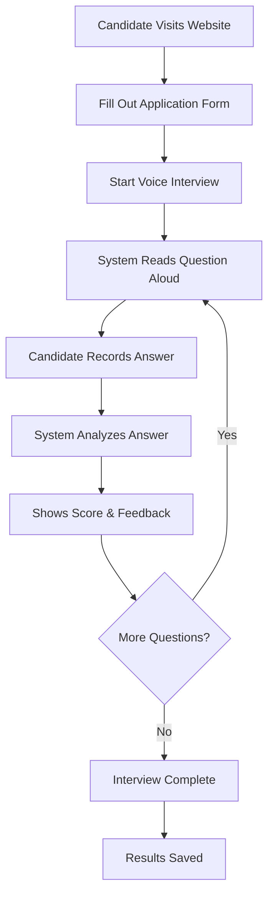
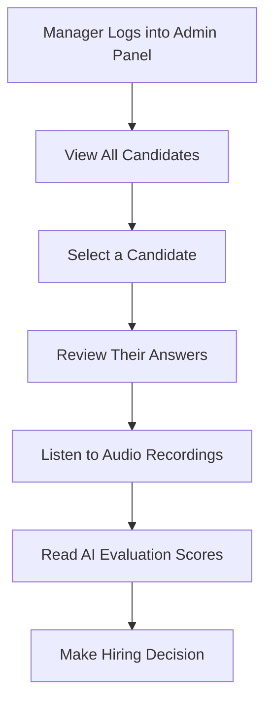

# Speech Evaluation System - Simple Process Flow

## What This System Does

This is a voice-based interview system that helps companies evaluate job candidates for call center and customer service positions. Instead of traditional written tests, candidates speak their answers, and the system provides instant feedback on their communication skills.

## How It Works - Simple Overview

### For Job Candidates

### For Hiring Managers

## Step-by-Step Process

### 1. Candidate Experience

**Step 1: Application**
- Candidate visits the website
- Fills out basic information (name, email, role applying for)
- System creates a unique session for them

**Step 2: Voice Interview**
- System asks 5-6 job-related questions
- Each question is read aloud by the computer
- Candidate speaks their answer (30-60 seconds recommended)
- System records their voice and shows a real-time waveform

**Step 3: Instant Feedback**
- System transcribes what the candidate said
- AI evaluates their answer on 5 key areas:
  - **Relevance**: Did they answer the question?
  - **Grammar**: Was their language clear and correct?
  - **Communication**: Did they express ideas well?
  - **Fluency**: Was their speech smooth and natural?
  - **Customer Service Fit**: Do they sound professional and helpful?

**Step 4: Results**
- Each answer gets a score (1-10) and helpful feedback
- Candidate can see their progress through the interview
- All results are saved for the hiring manager to review

### 2. Manager Experience

**Step 1: Access Admin Panel**
- Manager logs in with username and password
- Views dashboard with all candidate applications

**Step 2: Review Candidates**
- See list of all applicants with their basic information
- Search and filter candidates by name or date
- View completion status (how many questions they answered)

**Step 3: Detailed Review**
- Click on any candidate to see their full evaluation
- Listen to their actual voice recordings
- Read the AI's detailed analysis and scores
- See improvement suggestions for each answer

**Step 4: Make Decisions**
- Compare candidates based on scores and feedback
- Use audio recordings to hear actual communication style
- Make informed hiring decisions

## What Makes This System Special

### For Candidates
- **No Stress**: Speak naturally like in a real conversation
- **Immediate Feedback**: Know how you're doing right away
- **Fair Evaluation**: AI judges everyone the same way
- **Helpful Tips**: Get specific advice on how to improve

### For Companies
- **Save Time**: No need to schedule in-person interviews for initial screening
- **Consistent Evaluation**: Same standards applied to all candidates
- **Better Decisions**: Hear actual communication skills, not just written answers
- **Scalable**: Can evaluate many candidates quickly

## Key Features

### Smart AI Evaluation
The system looks at 5 important areas:
1. **Relevance** - Did they answer the question properly?
2. **Grammar & Vocabulary** - Is their language professional?
3. **Communication Skills** - Can they express ideas clearly?
4. **Fluency** - Do they speak smoothly without too many "um"s?
5. **Customer Service Fit** - Do they sound helpful and patient?

### Audio Management
- All voice recordings are saved and organized
- Managers can listen to actual candidate responses
- Easy to compare different candidates' communication styles

### User-Friendly Interface
- Simple, step-by-step process
- Real-time visual feedback during recording
- Clear scores and helpful comments
- Mobile-friendly design

## Example Questions

The system asks job-related questions like:
- "How would you handle an angry customer?"
- "Describe a time you solved a difficult problem"
- "What makes you a good fit for customer service?"
- "How do you stay organized when handling multiple tasks?"

## Benefits Summary

### For Job Seekers
- Practice speaking skills
- Get immediate, honest feedback
- Show communication abilities that written tests can't capture
- Receive specific improvement suggestions

### For Employers
- Screen candidates more efficiently
- Hear actual communication skills
- Make data-driven hiring decisions
- Reduce time spent on initial interviews
- Ensure consistent evaluation standards

This system bridges the gap between traditional written applications and in-person interviews, giving both candidates and employers a better way to evaluate communication skills for customer service roles. 