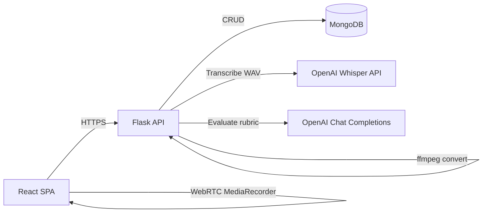
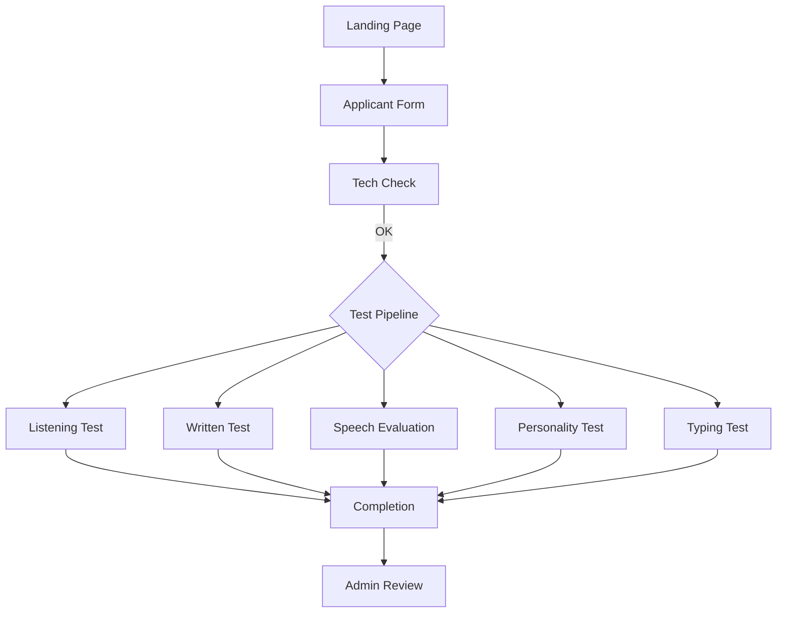
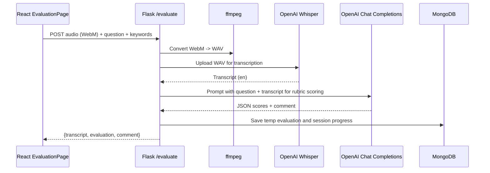

## Tele-net Comprehensive Evaluation Platform — Executive Overview

### Purpose
Deliver a streamlined, end-to-end screening platform for applicants across multiple assessments: speech evaluation, listening, written, personality, and typing. The platform reduces manual effort, standardizes scoring, and increases throughput for talent acquisition and operations teams.

### Top Outcomes
- Faster, consistent pre-screening with automated speech transcription and rubric-based scoring
- Single admin dashboard to review applicant progress and results
- Session-resumable testing to avoid lost progress and improve candidate experience

---

## System Architecture

- Frontend: React (Vite) SPA; manages applicant session, conducts tests, uploads recordings, and shows progress.
- Backend: Flask API with modular blueprints for `applicant`, `audio`, `questions`, `written`, `personality`, `typing`, `users`.
- Data: MongoDB for persistent storage (applicants, questions, temp evaluations, session states, users).
- AI Services:
  - OpenAI Whisper API for English speech transcription
  - OpenAI Chat Completions (gpt-3.5-turbo) for rubric-based evaluation
- Media: ffmpeg converts WebM to WAV for stable ASR.
- Auth: JWT for admin; role- and permission-based access control.



---

## Key Functions and Purpose (with Rationale)

### Backend Modules (Flask)

- backend/app.py
  - create_app(): Initializes Flask, CORS, registers blueprints; runs with TLS context. Rationale: modular route ownership, simple CORS for dev/LAN, HTTPS for security during media uploads.

- backend/routes/audio.py
  - POST /evaluate: accepts recorded audio, converts WebM→WAV via ffmpeg, runs evaluation; returns transcript, metrics, scores, comment. Rationale: normalizes input for ASR; stable, vendor-agnostic audio format.
  - POST /evaluate-listening-test: records mimic of a prompt (one-time play), stores per-question recordings. Rationale: captures pronunciation and listening accuracy in a controlled flow.
  - POST /speak-audio and served audio: provides question audio playback. Rationale: consistent audio delivery tied to question assets.

- backend/routes/questions.py
  - GET /question, /question_count, /question_status; POST /next_question, /reset_questions, /resume_session: orchestrate speech evaluation flow via session state. Rationale: resumable sessions, consistent progress tracking across devices and disconnections.

- backend/routes/written.py
  - GET /written/questions: delivers a randomized, per-session subset (20) without answer keys. Rationale: integrity of test content; fairness and reuse.
  - POST /written/submit: evaluates answers, computes score%, stores detailed per-question results. Rationale: transparent, auditable scoring.

- backend/routes/personality.py
  - GET /personality/questions: serves active personality items.
  - POST /personality/submit: computes category analysis and pass/fail per category; marks test completion. Rationale: lightweight, category-based signal aligned with HR needs.

- backend/routes/typing.py
  - GET /typing/test: returns a random typing excerpt.
  - POST /typing/submit: stores WPM/accuracy (calculated on client or server, depending on integration). Rationale: reflect a baseline operational skill.

- backend/routes/applicant.py
  - POST /store_applicant: validates and stores applicant metadata tied to sessionId (temp), server-side timestamping. Rationale: decouple data entry from evaluation, keep integrity and audit fields server-stamped.
  - POST /finish_evaluation: merges temp evaluation data into permanent applicant record; cleanup. Rationale: transactional finalize step for a complete packet.

- backend/routes/users.py
  - POST /auth/login, GET /auth/verify: JWT login and token verification. Rationale: secure admin-only features and auditability.
  - CRUD /users and role/permission endpoints: RBAC for super admin/admin/evaluator/viewer. Rationale: least-privilege operations.

### Backend Utilities

- backend/utils/session.py
  - get_session_state(), set_session_state(): persist session progress in MongoDB (with an in-memory cache). Rationale: resilience to refresh/interruptions, server-side truth.
  - get_active_questions_for_session(), move_to_next_question(), resume_session..., mark_test_completed(): consistent, per-test orchestration. Rationale: avoid front-end state drift.

- backend/utils/file_ops.py
  - save_audio_file(): structured storage recordings/<test>/applicant_session/ for auditability.
  - load_/save_*(questions/users/...): question banks and admin users persisted in MongoDB (no _id leak to client). Rationale: simple, portable data layer.
  - save_temp_evaluation()/load_temp_evaluation(): segmented temp store by test type. Rationale: flexible, partial saves and resumptions.
  - cleanup_temp_files()/cleanup_recordings(): removes temp data per session. Rationale: storage hygiene.

- backend/utils/evaluation.py + backend/test_eval.py
  - run_evaluation(): drives the full pipeline: transcribe with Whisper; rubric evaluation via Chat Completions; returns transcript, evaluation JSON, and comment. Rationale: separates I/O and model orchestration from routes; easier to swap providers.

- backend/utils/tts.py
  - speak_async(): OS-native TTS (pyttsx3) helper. Rationale: optional, local-only instructional feedback; not critical-path.

- backend/utils/auth.py
  - hash/verify password, generate/verify JWT, decorators require_auth, require_permission. Rationale: secure admin surface with roles and audited login.

- backend/utils/db.py
  - Central Mongo connection and session_states_collection handle. Rationale: single source of truth.

### Frontend (React) Key Components

- src/contexts/SessionContext.jsx
  - Manages sessionId and applicant info in localStorage; exposes startNewSession, clearSession, checkEvaluationAccess. Rationale: reliable client-side continuity and guarded routes.

- src/components/evaluationpage/EvaluationPage.jsx
  - Fetch/resume speech questions, record via MediaRecorder, POST audio to backend, display status and timers; marks completion. Rationale: guided, time-bound voice evaluation UX.

- src/components/listenTest/ListenTest.jsx
  - One-time audio playback per item, record mimic, submit recording, and enforce timing. Rationale: standardized pronunciation/listening test flow.

- src/components/common/GenericWrittenTest.jsx
  - Generic engine for written/personality-style tests with timer, nav, and submit. Rationale: reuse and consistent behaviors.

- src/components/admin/Admin.jsx
  - JWT login; tabs for Applicants, Questions, Listening Questions, Users; auto-logout; role-based sections. Rationale: secure, unified admin operations.

---

## Architectural Diagrams

### Applicant Journey


### Speech Evaluation Sequence


### Data Model (Simplified)
```mermaid
classDiagram
  class Applicant {
    id: string
    applicant_info: {...}
    speech_eval: Eval[]
    listening_test: Eval[]
    written_test: Eval[]
    personality_test: Eval[]
    typing_test: Eval[]
    application_timestamp: ISO8601
    completion_timestamp: ISO8601?
  }

  class SessionState {
    session_id: string
    current_index: number
    questions: Question[]
    has_answered: number[]
    test_completion: map<string,bool>
    last_updated: ISO8601
  }

  class Question {
    id: number
    text: string
    keywords: string[]
    audio_id: string
    active: bool
  }

  class Eval {
    type: string
    timestamp: ISO8601
    evaluation: JSON
    comment: string
  }

  Applicant "1" --> "*" Eval
  SessionState "1" --> "*" Question
```

---

## Why OpenAI Whisper and GPT (Rationale)

- Whisper API (ASR)
  - Accuracy on varied accents; robust to background noise
  - Cloud inference avoids GPU provisioning and driver maintenance
  - Low operational complexity: upload WAV, force English transcription
  - Alternatives considered: Deepgram (good SDK, also strong); self-hosted Whisper (no vendor fees, but high infra cost and ops complexity). We chose Whisper API to deliver faster time-to-value and lower operational burden.

- OpenAI Chat Completions (gpt-3.5-turbo)
  - Fast, cost-effective rubric scoring and textual feedback
  - Deterministic prompt structure returns JSON with category scores
  - Easily swappable model/version if future quality/cost trade-offs change

---

## Hardware, Software, and Operational Constraints

- Client devices
  - Microphone access required; browser permissions must be granted
  - Stable network for media upload and audio playback
  - Headphones recommended to avoid feedback loops

- Backend host
  - ffmpeg must be installed for audio conversion
  - Adequate CPU/RAM for concurrent conversions and request handling
  - Disk space for recordings/ (segmented by session and test type); periodic cleanup jobs recommended

- MongoDB
  - Local or remote; ensure authentication and firewalling in production
  - Collections: applicants, questions, listening_test_questions, written_test_questions, personality_test_questions, typing_tests, temp_*, session_states, users

- Secrets and TLS
  - OPENAI_API_KEY via .env; never committed
  - TLS certs (cert.pem, key.pem) configured for HTTPS; rotate per policy

- Performance
  - Whisper calls dominate latency; batching is not applicable per user-item, but parallelism across users is supported
  - Frontend uses MediaRecorder; ensure browsers meet constraints (Chrome/Edge/Firefox recent)

---

## Security and Compliance

- JWT-based admin auth; roles (super_admin, admin, evaluator, viewer) control access to data and actions
- No credentials in code; environment-driven config
- CORS restricted to known local/LAN origins for dev; tighten for production
- PII handling: applicant info stored in MongoDB; recommend database encryption at rest, transport TLS, and access logging
- Audit fields: server-side timestamps for application and completion events

---

## Follow-ups and Known Limitations

- Known gaps to harden for production:
  - Rate-limiting and abuse protection on upload endpoints
  - Storage lifecycle policy and archival for recordings/
  - Expand admin analytics and export
  - Migrate pyttsx3 local TTS to pre-generated audio assets if needed for scale

---

## Development Notes (Reason-by-Function Highlights)

- Session persistence in MongoDB (instead of purely client/localStorage) was implemented to ensure resilience to refreshes and device changes.
- Audio normalization with ffmpeg was chosen to maximize ASR accuracy by removing browser/container codec variability.
- Evaluation prompts are strict and JSON-returning to support deterministic parsing and admin dashboards downstream.
- Question delivery endpoints remove answer keys server-side to protect the test bank.
- Admin RBAC was introduced to enable future delegation (evaluator-only views without destructive permissions).

---

## Appendix: Deployment At-a-Glance

- Environment
  - Backend: Python 3.x, Flask, pymongo, pyttsx3, requests, python-dotenv
  - Frontend: Node + Vite, React
- Services
  - MongoDB (local or managed)
  - OpenAI Whisper + Chat Completions
- Required binaries
  - ffmpeg

This document omits test-week update logs and HR/PIS meeting notes because they are not available from the project workspace.


